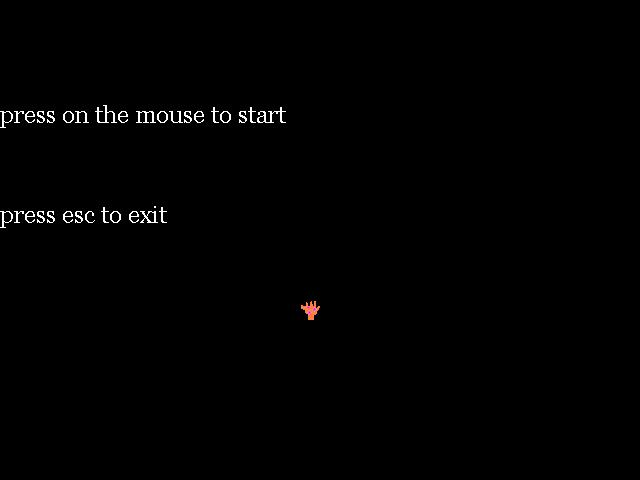



## a full directX animation with one picture

### Description

if u are a beginner in directX , u probably have the same problem I had. making an animation by using one picture only. its really easy. just download the example and see for yourself.

it also tells u how to use text in directX
 
### More Info
 

             |
---                |---
**Submitted On**   |2000-08-29 22:12:32
**By**             |[Eelectronic Cat](https://github.com/Planet-Source-Code/PSCIndex/blob/master/ByAuthor/eelectronic-cat.md)
**Level**          |Beginner
**User Rating**    |4.3 (17 globes from 4 users)
**Compatibility**  |VB 6\.0
**Category**       |[DirectX](https://github.com/Planet-Source-Code/PSCIndex/blob/master/ByCategory/directx__1-44.md)
**World**          |[Visual Basic](https://github.com/Planet-Source-Code/PSCIndex/blob/master/ByWorld/visual-basic.md)
**Archive File**   |[CODE\_UPLOAD138901182001\.zip](https://github.com/Planet-Source-Code/eelectronic-cat-a-full-directx-animation-with-one-picture__1-14509/archive/master.zip)

